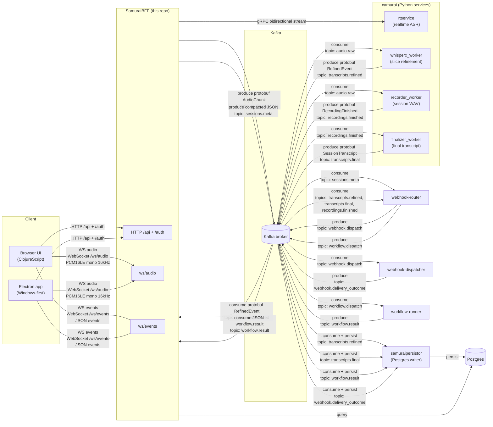

# samuraibff

Clojure BFF (backend-for-frontend) for the **nanosamur.ai** solution.

This repo contains:

* **Backend** (Clojure): HTTP/WS API + orchestration
* **UI** (ClojureScript): browser UI
* **Electron app (Windows-first)**: wraps the UI and can capture mic + (best-effort)
  system output audio

## Architecture (high level)



Read more:

* `docs/architecture.md`

## Related repositories / projects (nanosamur.ai)

Nanosamurai solution currently consists of:

* **SamuraiBFF** (this repo)
* **xamurai** https://github.com/mikub/xamurai (locally usually at `%USERPROFILE%\PycharmProjects\xamurai`)
  * xamurai is a monorepo with speech-to-text and speaker diarization services.
* **samuraipersistor** https://github.com/mikub/samuraipersistor (locally usually at `%USERPROFILE%\IdeaProjects\samuraipersistor`)
  * persistence service consuming Kafka topics and storing to Postgres.
* **nanodeploy** https://github.com/mikub/nanodeploy (locally usually at `%USERPROFILE%\PycharmProjects\nanodeploy`)
  * Helm charts / local k8s / docker compose setups.
* **nanplatform** https://github.com/mikub/nanplatform (locally usually at `%USERPROFILE%\PycharmProjects\nanplatform`)
  * Pulumi infra in AWS.
* **nanosamurai-sdk** https://github.com/mikub/nanosamurai-sdk (locally usually at `%USERPROFILE%\PycharmProjects\nanosamurai-sdk`)
* **webhook-router** (local: `%USERPROFILE%\IdeaProjects\webhook-router`)
* **webhook-dispatcher** (local: `%USERPROFILE%\IdeaProjects\webhook-dispatcher`)
* **workflow-runner** https://github.com/mikub/workflow-runner (local: `%USERPROFILE%\IdeaProjects\workflow-runner`)

## How to run (local dev)

This README documents **local developer workflows only**.
Docker/Kubernetes/CI/CD is owned by **nanodeploy**.

### Backend

```bash
clojure -M:run
```

Default local bind: `127.0.0.1:8000`.

### UI (browser)

Install npm deps once:

```bash
npm install
```

Run UI watcher:

```bash
clojure -M:cljs watch app
```

Open:

* http://127.0.0.1:8000/recordings
* http://127.0.0.1:8000/live

### Electron (Windows-first)

Electron connects to an **already-running** backend.

```bash
npm run electron:dev
```

Build Windows artifacts:

```bash
npm run electron:dist
```

Outputs: `dist/electron/`.

See:

* `docs/electron.md`
* `docs/electron-w1-system-audio-plan.md`

## Docs index

* Electron: `docs/electron.md`
* Architecture: `docs/architecture.md`
* Dev runbook (local): `docs/dev-runbook.md`
* Transcripts (realtime/refined/final): `docs/features-transcripts.md`
* Recordings + playback + karaoke: `docs/features-recordings-playback-karaoke.md`
* Webhooks + workflows: `docs/features-webhooks-workflows.md`
* Security + auth: `docs/security-auth.md`
* Ops + observability: `docs/ops-observability.md`
* Historical long-form README (archive): `docs/readme-archive.md`
