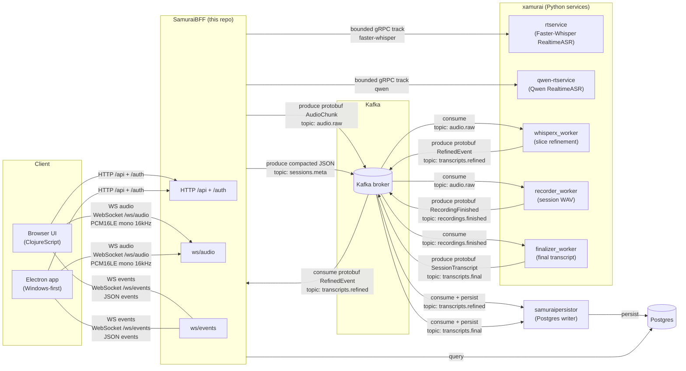

# samuraibff

Clojure BFF (backend-for-frontend) for the **nanosamur.ai** solution.

This repo contains:

* **Backend** (Clojure): HTTP/WS API + orchestration
* **UI** (ClojureScript): browser UI
* **Electron app (Windows-first)**: wraps the UI and can capture mic + (best-effort)
  system output audio

## Architecture (high level)



Read more:

* `docs/architecture.md`

Closing `/ws/audio` finishes the session's audio input: SamuraiBFF drains the
accepted frames and half-closes every selected realtime request while
`/ws/events` stays open long enough to deliver their terminal events.

Operators register one to four fixed realtime services with
`SAMURAIBFF_GRPC_REALTIME_TRACKS`. The browser receives their stable IDs and a
sanitized capability summary, never service addresses, runtime versions, model
revisions, or model digests, and can select any non-empty subset for a session.
Capability discovery is best-effort: an unavailable provider is marked
unavailable without failing `GET /api/me`. An omitted selection remains
compatible and uses every configured track. The live UI shows each provider's
mode, duration policy, timestamp and speaker-label support, concurrency, and
language count before recording, then labels each selected track and renders
simultaneous results side by side. For enriched providers the summary also
shows how many languages support aligned, diarized finals.
When the live UI's `Log ASR events` diagnostic is enabled, every compact ASR
line includes both the selected track ID and sanitized provider profile ID so
parallel provider events remain distinguishable.
The adjacent `Highlight updates` display toggle makes new or revised realtime
partials and finals flash with distinct colors, which helps compare concurrent
provider tracks without changing their transcription settings or results.

## Related repositories / projects (nanosamur.ai)

The Community Edition consists of:

* **SamuraiBFF** (this repo)
* **xamurai** https://github.com/nanosamurai/xamurai
  * xamurai is a monorepo with speech-to-text and speaker diarization services.
* **samuraipersistor** https://github.com/nanosamurai/samuraipersistor
  * persistence service consuming Kafka topics and storing to Postgres.
* **nanosamurai** https://github.com/nanosamurai/nanosamurai
  * public Docker Compose quickstart and operator guidance.
* **nanosamurai-sdk** https://github.com/nanosamurai/nanosamurai-sdk the
  Python client SDK.

## How to run (local dev)

This README documents **local developer workflows only**. This repository owns
its CI checks and service-image publication. For the supported Community Edition
Docker Compose setup, use the
[nanosamurai quickstart](https://github.com/nanosamurai/nanosamurai).

### Backend

```bash
clojure -M:run
```

Default local bind: `127.0.0.1:8000`.

Community Edition mode is enabled by default. It hides/disables workflow and
webhook runtime features unless `SAMURAIBFF_CE_MODE=false` is set by a
commercial/full deployment.

### UI (browser)

The browser UI uses the nanosamur.ai logo as its favicon.

Install npm deps once:

```bash
npm install
```

Run UI watcher:

```bash
clojure -M:cljs watch app
```

Open:

* http://127.0.0.1:8000/recordings (Sessions)
* http://127.0.0.1:8000/live (Record)

### Tests

Run the full unit + integration test suite:

```bash
clojure -X:test
```

See `docs/dev-runbook.md` for the lightweight CI test plan (`clojure -X:ci`),
WS integration test prerequisites, proto generation, and nREPL.

### Electron (Windows-first)

Electron connects to an **already-running** backend.
Both development and packaged builds load the UI from that backend, keeping
assets, REST, authentication, recording playback, and WebSockets same-origin.
The desktop shell pins Electron 43.4.0, a supported Electron release line with
Chromium 150; Electron and electron-builder updates are monitored weekly.
The BFF remains responsible for all S3 access; Electron never connects to S3 or
LocalStack directly.
The nanosamur.ai icon is used for the Electron window, Windows executables,
shortcuts, installer, and uninstaller.

The backend defaults to `http://localhost:8000`. Set the canonical API URL for
a different local or cloud deployment before launching Electron:

```powershell
$env:NANOSAMURAI_API_URL = "https://your-nanosamurai.example"
```

Remote origins must use HTTPS. Plain HTTP is accepted only for loopback hosts.

```bash
npm run electron:dev
```

Build Windows artifacts:

```bash
npm run electron:dist
```

Outputs: `dist/electron/`.

Windows Developer Mode (or equivalent symlink privileges) is required for
electron-builder to extract its executable-editing helpers. Local artifacts are
unsigned unless code-signing credentials are configured.

See:

* `docs/electron.md`
* `docs/electron-w1-system-audio-plan.md`

## Docs index

* Documentation policy (where to put docs): `docs/documentation-policy.md`
* Electron: `docs/electron.md`
* Architecture: `docs/architecture.md`
* Dev runbook (local): `docs/dev-runbook.md`
* CI and image publication: `docs/ci-cd.md`
* API docs (OpenAPI/Swagger + REST overview): `docs/api.md`
* WebSocket contracts (`/ws/audio`, `/ws/events`): `docs/ws-contract.md`
* Storage (Postgres + S3): `docs/storage.md`
* Transcripts (realtime/refined/final): `docs/features-transcripts.md`
* Recordings + playback + karaoke: `docs/features-recordings-playback-karaoke.md`
* Webhooks + workflows: `docs/features-webhooks-workflows.md`
* Security + auth: `docs/security-auth.md`
* Ops + observability: `docs/ops-observability.md`
