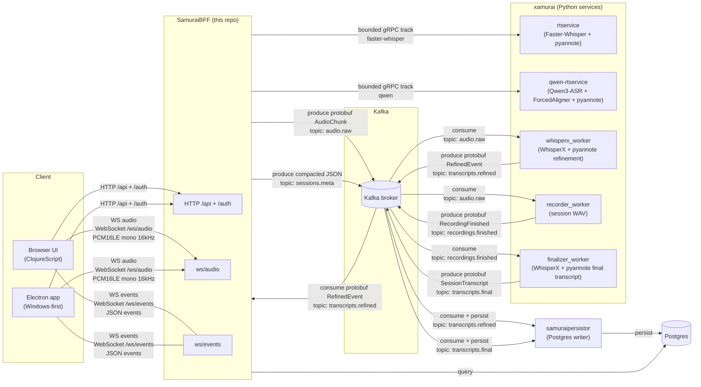

# samuraibff

Clojure BFF (backend-for-frontend) for the **nanosamur.ai** solution.

This repo contains:

* **Backend** (Clojure): HTTP/WS API + orchestration
* **UI** (ClojureScript): browser UI
* **Electron app (Windows-first)**: wraps the UI and can capture mic + (best-effort)
  system output audio

## Architecture (high level)



Read more:

* `docs/architecture.md`

Closing `/ws/audio` finishes the session's audio input: SamuraiBFF drains the
accepted frames and half-closes every selected realtime request while
`/ws/events` stays open until each selected track reports completion, allowing
its terminal ASR event to arrive before the browser disconnects.

After a normal audio close, the same dispatch loop sends an empty `AudioChunk`
with Kafka header `x-audio-end=true` after the last accepted frame, using the
same producer, `audio.raw` topic and session key/partition. Producer idempotence
preserves ordering on retries. This also drains sessions without `/ws/events`.
The recorder finalizes immediately on this marker; abnormal disconnects and
older producers retain the 30-second idle fallback. The finish API only updates
database status. Refinement ignores the empty marker and retains its idle tail.

Operators register one to four fixed realtime services with
`SAMURAIBFF_GRPC_REALTIME_TRACKS`. The browser receives their stable IDs and a
sanitized capability summary, never service addresses, runtime versions, model
revisions, or model digests, and can select any non-empty subset for a session.
Capability discovery is best-effort: an unavailable provider is marked
unavailable without failing `GET /api/me`. An omitted selection uses the configured
default track, or every configured track when no default is set. The live UI shows each provider's
mode, duration policy, timestamp and speaker-label support, concurrency, and
language count before recording, then labels each selected track and renders
simultaneous results side by side. For enriched providers the summary also
shows how many languages support aligned, diarized finals.

While following the live transcript, the feed scrolls before painting each
message revision, including partials that grow inside an existing bubble.
Scrolling up pauses following until the reader returns near the bottom.
**Highlight updates** flashes changed words without adding inline padding or
negative margins, so enabling it preserves the text's natural line wrapping.

Each configured address is resolved through gRPC DNS with `round_robin`.
Before the BFF forwards audio it waits for the selected replica's
`SESSION_ACCEPTED` response. An unadmitted `REPLICA_FULL` call is retried on a
new RPC, bounded by `SAMURAIBFF_GRPC_ADMISSION_MAX_ATTEMPTS` (default `8`) and
`SAMURAIBFF_GRPC_ADMISSION_TIMEOUT_MS` (default `3000`). Kubernetes should
provide a headless Service and Compose should provide multi-address service
DNS; the BFF never registers pod IPs itself.

## Related repositories / projects (nanosamur.ai)

The Community Edition consists of:

* **SamuraiBFF** (this repo)
* **xamurai** https://github.com/nanosamurai/xamurai
  * xamurai is a monorepo with speech-to-text and speaker diarization services.
* **samuraipersistor** https://github.com/nanosamurai/samuraipersistor
  * persistence service consuming Kafka topics and storing to Postgres.
* **nanosamurai** https://github.com/nanosamurai/nanosamurai
  * public Docker Compose quickstart and operator guidance.
* **nanosamurai-sdk** https://github.com/nanosamurai/nanosamurai-sdk the
  Python client SDK.

## How to run (local dev)

This README documents **local developer workflows only**. This repository owns
its CI checks and service-image publication. For the supported Community Edition
Docker Compose setup, use the
[nanosamurai quickstart](https://github.com/nanosamurai/nanosamurai).

### Backend

```bash
clojure -M:run
```

Default local bind: `127.0.0.1:8000`.

Community Edition mode is enabled by default. It hides/disables workflow and
webhook runtime features unless `SAMURAIBFF_CE_MODE=false` is set by a
commercial/full deployment.

### UI (browser)

The browser UI uses the nanosamur.ai logo as its favicon.

Install npm deps once:

```bash
npm install
```

Run UI watcher:

```bash
clojure -M:cljs watch app
```

Open:

* http://127.0.0.1:8000/recordings (Sessions)
* http://127.0.0.1:8000/live (Record)

### Tests

Run the full unit + integration test suite:

```bash
clojure -X:test
```

See `docs/dev-runbook.md` for the lightweight CI test plan (`clojure -X:ci`),
WS integration test prerequisites, proto generation, and nREPL.

### Electron (Windows-first)

Electron connects to an **already-running** backend.
Both development and packaged builds load the UI from that backend, keeping
assets, REST, authentication, recording playback, and WebSockets same-origin.
The desktop shell pins Electron 43.4.0, a supported Electron release line with
Chromium 150; Electron and electron-builder updates are monitored weekly.
The BFF remains responsible for all S3 access; Electron never connects to S3 or
LocalStack directly.
The nanosamur.ai icon is used for the Electron window, Windows executables,
shortcuts, installer, and uninstaller.

The backend defaults to `http://localhost:8000`. Set the canonical API URL for
a different local or cloud deployment before launching Electron:

```powershell
$env:NANOSAMURAI_API_URL = "https://your-nanosamurai.example"
```

Remote origins must use HTTPS. Plain HTTP is accepted only for loopback hosts.

```bash
npm run electron:dev
```

Build Windows artifacts:

```bash
npm run electron:dist
```

Outputs: `dist/electron/`.

Windows Developer Mode (or equivalent symlink privileges) is required for
electron-builder to extract its executable-editing helpers. Local artifacts are
unsigned unless code-signing credentials are configured.

See:

* `docs/electron.md`
* `docs/electron-w1-system-audio-plan.md`

## Docs index

* Documentation policy (where to put docs): `docs/documentation-policy.md`
* Electron: `docs/electron.md`
* Architecture: `docs/architecture.md`
* Dev runbook (local): `docs/dev-runbook.md`
* CI and image publication: `docs/ci-cd.md`
* API docs (OpenAPI/Swagger + REST overview): `docs/api.md`
* WebSocket contracts (`/ws/audio`, `/ws/events`): `docs/ws-contract.md`
* Storage (Postgres + S3): `docs/storage.md`
* Transcripts (realtime/refined/final): `docs/features-transcripts.md`
* Recordings + playback + karaoke: `docs/features-recordings-playback-karaoke.md`
* Webhooks + workflows: `docs/features-webhooks-workflows.md`
* Security + auth: `docs/security-auth.md`
* Ops + observability: `docs/ops-observability.md`

## Final tracks (first spike)

Set `SAMURAIBFF_FINAL_TRACKS` to a comma-separated allowlist of up to four
stable lowercase IDs (default `whisperx`). `/ws/audio` accepts `final_tracks`
as an ordered CSV selection. Omission selects the configured default, falling
back to the first configured ID (normally `whisperx`); explicit IDs must
be configured, unique and nonempty. Multiple final tracks require
`store_recording=true`, and the `final` stage toggle remains authoritative.

BFF saves controls in the tenant-scoped session before accepting audio and
uses that same snapshot on reconnect. It forwards `x-final-tracks` on the
existing audio topic and copies the controls into `sessions.meta.stream_controls`.
`GET /api/recordings/{session_id}` exposes each result's `track_id`, text and
unchanged segment array. Optional `?track_id=<id>` filters final results;
old NULL rows read as `whisperx`. Authorization and shared audio playback
remain tenant scoped. Apply deployment migration 017 before starting this BFF.

The final protobuf only adds `SessionTranscript.track_id = 9`; Java bindings
are generated by the existing Buf build. The existing session status does not prove that every
selected finalizer has completed. Enable multiple final tracks only in local
Community Edition validation until webhook/workflow consumers are migrated.

Docker build contexts exclude `.env` files and scratch worktrees. Integration
fixtures bind test ports to localhost; when running locally set
`TESTCONTAINERS_RYUK_DISABLED=true` and let fixture cleanup stop containers.
## Refinement track contract

Refinement tracks add only `RefinedEvent.track_id = 16`; an empty ID means
`whisperx`. Audio, segment and word message shapes and Kafka keys stay unchanged.


`SAMURAIBFF_REFINEMENT_TRACKS` lists up to four configured IDs (default
`whisperx`). `/ws/audio?refinement_tracks=test-shadow,whisperx` validates the
ordered selection and stores it beside `final_tracks` in `sessions.stream_controls`
before accepting audio. Reconnects use the saved snapshot; old sessions default
to WhisperX. The audio handler copies the same controls to `sessions.meta` and
sends `x-refinement-tracks` on `audio.raw`. The `refined` stage toggle remains
authoritative. Final and refinement selections are independent.

Live refined JSON includes `track_id`, `window_sec`, `window_start_s`,
`window_end_s`, `slice_index` and the existing segment's zero-based
`segment_index` in the fan-out. These identify the existing window/segment;
there is no execution ID or new envelope. The tenant-scoped registry and
BFF-to-BFF callback route remain unchanged. Live buffers keep first deliveries
per track/window/segment and apply their cap per track, with separate session
caches. Saved refinement conversion retains the same track/window identity.
`GET /api/recordings/:session_id?track_id=...` filters both refined and final
records, retaining tenant checks and the existing text/segments JSON shape.

Selection controls and labelled browser tabs are available in spike 3. Current
session status is not a per-track success/failure report. See
`docs/refinement-tracks-spike.md` and `docs/track-selection-ui.md` for validation.

## Track selection and labels

Optional deployment defaults select one track when the caller enables a stage
without specifying its tracks:

| Environment variable | Stage | When unset or blank |
| --- | --- | --- |
| `SAMURAIBFF_DEFAULT_REALTIME_TRACK` | Real-time | All configured realtime tracks |
| `SAMURAIBFF_DEFAULT_REFINEMENT_TRACK` | Refined | First `SAMURAIBFF_REFINEMENT_TRACKS` ID, otherwise `whisperx` |
| `SAMURAIBFF_DEFAULT_FINAL_TRACK` | Final | First `SAMURAIBFF_FINAL_TRACKS` ID, otherwise `whisperx` |

Each value must be one ID in that stage's configured allowlist; BFF rejects
invalid defaults at startup. Defaults do not register or start workers.
Explicit selections win, and disabled stages stay disabled. `GET /api/me`
returns configured IDs in `default_tracks` (`realtime`, `refined`, `final`);
the browser uses them for preselection and live results. The resolved choices
are frozen in the existing session controls at audio admission, including on
reconnect. Changing defaults affects new sessions; existing choices, historical
WhisperX fallback and `primary_track` event semantics are unchanged.

The existing `GET /api/me` returns `async_tracks`: a small list of configured
`stage`, `track_id`, `display_name` and `default_selected` values. This is static
deployment metadata, not worker discovery. `SAMURAIBFF_TRACK_LABELS` optionally
sets labels as JSON, for example
`{"final":{"whisperx":"WhisperX"},"refined":{"whisperx":"WhisperX"}}`.
Each label is 1–100 characters. Unlabelled IDs display as themselves, except
`whisperx`, which displays as `WhisperX`.

At audio admission BFF copies the selected server labels into
`stream_controls.track_labels` and the existing `sessions.meta` event. Reconnects
preserve this snapshot. Client-supplied labels are ignored. No migration, topic,
table, result envelope or transcript JSON shape is added.

Session settings have Real-time, Refined, Final and Recording tabs. Clearing a
stage's last track disables it; re-enabling restores choices. Execution choices
lock at audio start, while New session retains preferences. Alternative-only
selections work independently for final and refinement. Multiple final tracks
require retained audio; refinement alone does not retain recording windows.

Realtime settings are defined by each service through `GetCapabilities`, exposed
in `/api/me`, and rendered per selected track: booleans, integers, and decimals
with two decimal places. The UI submits defaults plus edits as `realtime_settings`;
audio admission freezes these in the existing stream-controls snapshot and
`sessions.meta`. Each service receives its own values in `x-rt-settings`.
The old flat Whisper controls are replaced. See [the WebSocket contract](docs/ws-contract.md)
for the map shape and the deliberately limited SDK validation in this spike.

Live refinement is separated by track. Saved sessions show flat labelled tabs
from selections and actual Postgres rows, preserving missing-result tabs without
inferring failure. Recording playback appears only on Final Transcript tabs;
Follow sits beside the Playback title and uses the Record panel checkbox style.
Playback highlighting uses the selected final track's existing word timing.
Text-only results remain readable without fabricated timing or
speakers. Direct links and reloads preserve the session and nested controls.
Realtime messages without a speaker label retain the `?` avatar and `Unknown`
name, keeping partial text aligned with diarized turns.
